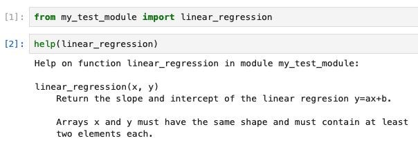

# Documenting software

## Introduction

Although it is difficult to pin down who first said _"code is read more often than it is written"_, they were probably right.

Writing adequate documentation for your software will help yourself, other contributors, and users of your code. Some documentation tools (such as parameter annotation) can even help you prevent bugs.

Below is one attempt at identifying different levels of achievement in documenting code:

 1. Self-documenting code (good names for variables, functions, etc.)

 2. Comments and docstrings.

 3. Python annotations.

 4. Well-formatted documentation, using tools such as:

    - [Sphynx](https://www.sphinx-doc.org/en/master/)

    - [MkDocs](https://www.mkdocs.org/)

    - [Jupyter Book](https://jupyterbook.org/en/stable/intro.html)

 5. Standardized docstrings and automatic documentation (with the tools listed above)

 6. Automatic deployment with tools such as [Read the Docs](https://about.readthedocs.com/)

For M2 internships, levels 1 and 2 are expected of all. Levels 3 through 5 are mostly relevant if you develop an external library containing more than a few functions. Level 6 is for wide-scale deployment.

## Self documenting-code

Consider this short Python function:

```Python
def fct(a, b):
    v1 = a.mean()
    v2 = b.mean()
    x = ((a - v1) * (b - v2)).sum() / ((a - v1)**2).sum()
    y = v2 - x * v1
    return x, y
```

What does this function do? It is difficult to known without squinting at the inner code for some time. Let us re-write it, just by changing some of the names:

```Python
def linear_regression(x, y):
    xmean = x.mean()
    ymean = y.mean()
    slope = ((x - xmean) * (y - ymean)).sum() / ((x - xmean)**2).sum()
    intercept = ymean - slope * xmean
    return slope, intercept
```

It is now quite obvious that this function calculates the coefficients of the linear regression `y = slope * x + intercept`. The code is exactly the same as before as far as the Python interpreter is concerned, but now the function is self-documenting as far as humans are concerned.

There is no golden or unique rule for chosing good names in your code, but here is some advice:

 - Use names that are descriptive and short, but avoid ambiguity. The [FORTRAN style guide](https://fortran-lang.org/learn/best_practices/style_guide/) give a good example:

> "spline interpolation" can be shortened to `spline_interpolation`, `spline_interpolate`, `spline_interp`, `spline`, but not to `splineint` ("int" could mean integration, integer, etc. - too much ambiguity, even in the clear context of a computational code). This is in contrast to `get_argument()` where `getarg()` is perfectly clean and clear.

 - Follow the conventions used by the community. For example, in Python, CamelCase is used for names of classes while functions, variables, and class instances use lower-case names, with underscores when necessary.

## Comments and docstrings

There are two target audiences for software documention: developers and users.

We usually rely on comments to document code for oneself and other developers, whereas we rely on dosctrings to document code for users.

### Comments

Comments are arbitrary pieces of text that are ignored by the Python interpreter. They are very useful to:

 - Explain what a block of code does so that the reader knowns without having to read the code

 - Organize the code in sections

 - Cite a reference for a method

Good comments tell **what** a piece of code does, but not **how** it does it. There is no need to explain how code works if the code is clean and well-written.

Consider this example:

```Python
vector = [45, 12, -4, 31, -57, -100, 10, 0]

# Sort the vector by swithing values two-by-two if they are in the wrong order,
# and repeating this process until there is nothing left to switch
while True:
    untouched = True
    for i in range(len(vector)-1):
        if vector[i] > vector[i+1]:
            vector[i], vector[i+1] = vector[i+1], vector[i]
            untouched = False
    if untouched:
        break
```

Here it is sufficient to say what the code does and, in this case, mention the name of the algorithm:

```Python
vector = [45, 12, -4, 31, -57, -100, 10, 0]

# Sort the vector using the bubble-sort algorithm
while True:
    untouched = True
    for i in range(len(vector)-1):
        if vector[i] > vector[i+1]:
            vector[i], vector[i+1] = vector[i+1], vector[i]
            untouched = False
    if untouched:
        break
```

Also, avoid comments that state things that are already made obvious by the code, such as:

```
# Assign values to a and b
a = 3
b = 4
```

Here is another example from the real world (adapted from the [SciPy source code](https://github.com/scipy/scipy/blob/main/scipy/stats/_stats_py.py), Copyright The SciPy Developers, BSD 3-clause license):

```Python
# Select the percentile function to use based on nans and policy
if nan_policy == 'omit' and contains_nan:
    percentile_func = np.nanpercentile
else:
    percentile_func = np.percentile
```

### Docstrings

A docstring is a piece of text that documents a function, a class, or a script. It is delimited by triple quotes. In a function, it immediately follows the header of the function (in a script, it is located at the top of the file). For example, adapting the linear regression function from above:

```Python
def linear_regression(x, y):
    """Return the slope and intercept of the linear regresion y=ax+b.

    Arrays x and y must have the same shape and must contain at least
    two elements each.

    """
    if x.shape != y.shape or x.size < 2:
        raise ValueError("Bad input arrays.")
    xmean = x.mean()
    ymean = y.mean()
    slope = ((x - xmean) * (y - ymean)).sum() / ((x - xmean)**2).sum()
    intercept = ymean - slope * xmean
    return slope, intercept
```

Docstrings usually contain a self-sufficient one-liner description of the function (or class, or script), followed, if necessary, by more detail. Function docstrings should describe at the very least the input arguments and the return value of the function.

The Python function `help` shows docstrings, so you can access documentation directly from Python, without having to look at the source code. For example:



If they are formatted in a very specific way, docstrings can even be used to automatically generate user-friendly documentation in the form of a website. This topic is covered further below.

## Annotations
