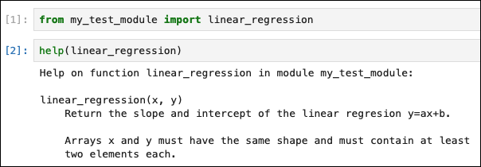
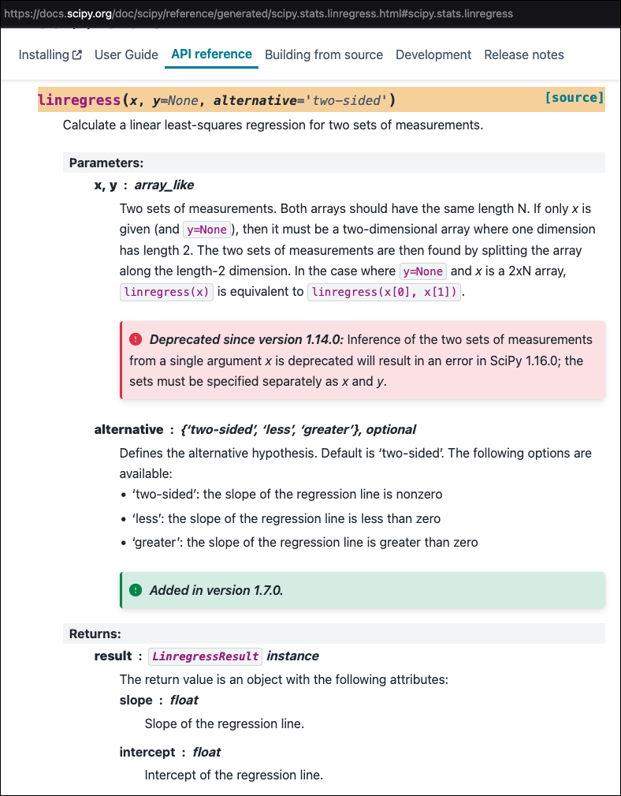

# Documenting software

## Motivation and objectives

Although it is difficult to pin down who first said _"code is read more often than it is written"_, they were probably right.

Writing adequate documentation for your software will help yourself, other contributors, and users of your code. Some documentation tools (such as type hinting) can even help you prevent bugs.

Below is one attempt at identifying different levels of achievement in documenting your Python code:

 1. Self-documenting code (good names for variables, functions, etc.)

 2. Comments and docstrings

 3. Type hints

 4. Well-formatted and automatic documentation, using tools such as:

    - [Sphynx](https://www.sphinx-doc.org/en/master/)

    - [MkDocs](https://www.mkdocs.org/)

    - [Jupyter Book](https://jupyterbook.org/en/stable/intro.html)

 5. Automatic deployment with tools such as [Read the Docs](https://about.readthedocs.com/)

For M2 internships, levels 1 and 2 are expected of all. Levels 3 and 4 are mostly relevant if you develop a module or package containing more than a few functions. Level 5 is for wide-scale deployment.

## Self documenting-code

Consider this short Python function:

```Python
def fct(a, b):
    v1 = a.mean()
    v2 = b.mean()
    x = ((a - v1) * (b - v2)).sum() / ((a - v1)**2).sum()
    y = v2 - x * v1
    return x, y
```

What does this function do? It is difficult to known without squinting at the inner code for some time. Let us re-write it, just by changing some of the names:

```Python
def linear_regression(x, y):
    xmean = x.mean()
    ymean = y.mean()
    slope = ((x - xmean) * (y - ymean)).sum() / ((x - xmean)**2).sum()
    intercept = ymean - slope * xmean
    return slope, intercept
```

It is now quite obvious that this function calculates the coefficients of the linear regression `y = slope * x + intercept`. The code is exactly the same as before as far as the Python interpreter is concerned, but now the function is self-documenting as far as humans are concerned.

There is no golden or unique rule for chosing good names in your code, but here is some advice:

 - Use names that are descriptive and short, but avoid ambiguity. The [FORTRAN style guide](https://fortran-lang.org/learn/best_practices/style_guide/) gives an example:

> "spline interpolation" can be shortened to `spline_interpolation`, `spline_interpolate`, `spline_interp`, `spline`, but not to `splineint` ("int" could mean integration, integer, etc. - too much ambiguity, even in the clear context of a computational code). This is in contrast to `get_argument()` where `getarg()` is perfectly clean and clear.

 - On the other hand, the [Google's Python style guide](https://github.com/google/styleguide/blob/gh-pages/pyguide.md) recommands avoiding abbreviations. A perfect coding style probably does not exist. Rather, it is a matter of making sensible choices and using these choices consistently throughout your code.

 - Follow the conventions used by the community. For example, in Python, CamelCase is used for names of classes while functions, variables, and class instances use lower-case names, with underscores when necessary.

 - If you contribute code to a project, follow the project's own coding style, not your own!

:brain: :pencil: Practice exercise :pencil: :brain: Look at the code you have written so far for your internship. Are there any poorly-named variables or functions? If yes, fix it now.

## Comments and docstrings

There are two target audiences for software documention: developers and users.

We usually rely on comments to document code for oneself and other developers, whereas we rely on dosctrings to document code for users.

### Comments

Comments are arbitrary pieces of text that are ignored by the Python interpreter. They are useful to:

 - Explain what a block of code does so that the reader knowns without having to read the code

 - Organize the code in sections

 - Cite a reference for a method

Good comments tell **what** a piece of code does, but not **how** it does it. There is no need to explain how code works if the code is clean and well-written.

Consider this example:

```Python
vector = [45, 12, -4, 31, -57, -100, 10, 0]

# Sort the vector by swithing values two-by-two if they are in the wrong order,
# and repeating this process until there is nothing left to switch
while True:
    untouched = True
    for i in range(len(vector)-1):
        if vector[i] > vector[i+1]:
            vector[i], vector[i+1] = vector[i+1], vector[i]
            untouched = False
    if untouched:
        break
```

Here it is sufficient to say what the code does and to mention the name of the algorithm:

```Python
vector = [45, 12, -4, 31, -57, -100, 10, 0]

# Sort the vector using the bubble-sort algorithm
while True:
    untouched = True
    for i in range(len(vector)-1):
        if vector[i] > vector[i+1]:
            vector[i], vector[i+1] = vector[i+1], vector[i]
            untouched = False
    if untouched:
        break
```

Also, avoid comments that state things that are already made obvious by the code, such as:

```Python
# Assign values to a and b
a = 3
b = 4
```

:brain: :pencil: Practice exercise :pencil: :brain: Look at the code you have written so far for your internship. Are there large sections that are lacking comments and that are difficult to understand? If yes, use comments to make your code more readable. Are there any stating-the-obvious comments? If yes, take the time to clean out your code now.

### Docstrings

A docstring is a piece of text that documents a function, a class, or a script. It is delimited by triple quotes. In a function, it immediately follows the header of the function, while in a script it is located at the top of the file. For example, adapting the linear regression function from above:

```Python
def linear_regression(x, y):
    """Return the slope and intercept of the linear regresion y=ax+b.

    Arrays x and y must have the same shape and must contain at least
    two elements each.

    """
    if x.shape != y.shape or x.size < 2:
        raise ValueError("Bad input arrays.")
    xmean = x.mean()
    ymean = y.mean()
    slope = ((x - xmean) * (y - ymean)).sum() / ((x - xmean)**2).sum()
    intercept = ymean - slope * xmean
    return slope, intercept
```

> [!TIP]
> Docstrings usually contain a self-sufficient one-liner description of the function (or class, or script), followed, if necessary, by more detail.

Function docstrings should describe at the very least:

 - The input arguments
 - The return value

The Python function `help` shows docstrings, so you can access documentation directly from Python, without having to look at the source code. For example, we can take a look at the documentation we just wrote for our function:



> [!TIP]
> In Jupyter notebooks, you can also press `SHIFT+TAB` to show the docstring of a function while you are writing the function's input arguments (ie. when the cursor is somewhere after the opening parenthesis following the function's name).

For example:


If they are formatted in a very specific way, docstrings can even be used to automatically generate user-friendly documentation in the form of a website. This topic is covered further below.

:brain: :pencil: Practice exercise :pencil: :brain: Did you write any function for your internship so far? If yes, take the time to write the docstring for one of these functions. Make sure that you can access the docstring from your Jupyter notebook. Write the docstring for your other functions as soon as reasonable.

## Type hints

Python is a dynamically-typed language, meaning that a programmer does not have to specify explicitly the types of variables (this is unlike statically-typed languages such as C or FORTRAN).

> [!NOTE]
> The type of a variable refers to the type of data that the variable can "hold". Examples of types include integer (`int`), character string (`str`), floating-point number (`float`), Numpy array (`np.array`), etc.

Dynamically-typed languages have benefits such as flexibility and conciseness. One downside is that it is difficult to know what type of data a function expects as input. In our `linear_regression` example, it is difficult to know whether `x` and `y` can be lists of numbers or whether they must be Numpy arrays.

In Python, type hints explicitly indicate the types of a function's arguments (with a colon `:`), and the type of its returned value (with the symbol `->`), for example:

```Python
from typing import Tuple
import numpy as np

def linear_regression(x: np.ndarray, y: np.ndarray) -> Tuple[float, float]:
    """Return the slope and intercept of the linear regresion y=ax+b.

    Arrays x and y must have the same shape and must contain at least
    two elements each.

    """
    ...
```

Even without mastering the syntax of type hints, it should now be quite obvious that our linear regression function expects Numpy arrays as input arguments, and that it returns two numbers (which are the slope and the intercept).

> [!IMPORTANT]
> Type hints are entirely optional. In fact, Python will mostly ignore them and will not stop you from calling functions with arguments that do not match its type hints. Python remains a dynamically-typed language even with type hints. There exist third-party tools such as [mypy](https://mypy.readthedocs.io/en/stable/getting_started.html) that analyze your code and tell you when your code does not respect type hints. These type-checking tools can help you reduce the probably of bugs in your code, by detecting unintended use of functions. There are also third-party tools that enforce type-checking at run time.

While the general idea of type hints is quite intuitive, the exact syntax is not, especially when working with complex data types. This section is meant to give you a taste of type hints, not a complete overview. You can find more exhaustive information at:

 - This [realpython.com guide](https://realpython.com/python-type-checking/), which is a good introduction to typing in Python

 - Python's [PEP 3107 on function annotations](https://peps.python.org/pep-3107/) and [PEP 484 on type hints](https://peps.python.org/pep-0484/), which describe typing in a technical manner

# Well-formatted and automatic documentation

If you use third-party packages ([Numpy](https://numpy.org/), [Scipy](https://scipy.org/), etc.), you most likely have come across their documentations on the web, which are often build with tools such as:

 - [Sphynx](https://www.sphinx-doc.org/en/master/)

 - [MkDocs](https://www.mkdocs.org/)

 - [Jupyter Book](https://jupyterbook.org/en/stable/intro.html)

These tools create webpages (HTML + JavaScript) from text files written in markdown or other simplified markup languages. One of their most interesting features (available natively or via plugins) is their capacity to automatically generate documentation directly from docstrings (and optionally type hints) found in Python code.

Have a look below at the docstring of [Scipy](https://scipy.org/)'s `linregress` function, and then at the corresponding online Scipy documentation, which was generated with Sphinx. Do you notice any resemblance?




These tools expect docstrings to be written in a predictable format. There exist several widely-adopted conventions for such docstrings, two of which are:

1. The [Numpy/Scipy style](https://numpydoc.readthedocs.io/en/latest/format.html#), which is very human-readable but not very compact. It uses lines of dashes to separate sections:

```Python
def linear_regression(x, y):
    """Calculate the linear regresion y = a * x + b.

    Parameters
    ----------
    x : np.array
        The x values (ie. the independent variable).
    y : np.array
        The y values (ie. the dependent variable).

    Returns
    -------
    (float, float)
        The slope and intercept.

    Raises
    ------
    ValueError
        If the shapes of x and y mismatch.

    """
```

2. The [Google style](https://github.com/google/styleguide/blob/gh-pages/pyguide.md), which is more compact but more difficult to read for long docstrings. It uses indentation to separate sections:

```Python
def linear_regression(x, y):
    """Calculate the linear regresion y = a * x + b.

    Args:
        x (np.array): The x values (ie. the independent variable).
        y (np.array): The y values (ie. the dependent variable).

    Returns:
        (float, float): The slope and intercept.

    Raises:
        ValueError: the shapes of x and y mismatch.

    """
```

Even if you do not plan to use automatic documentation tools just yet, it might be a good idea to choose one of these styles for your docstrings and stick to it. This way, other developers will navigate and understand your docstrings easily. Besides, should you ever decide to use automatic documentation tools, most of the work will already be done.

How to install, configure, and use these tools to create documentation is beyond the scope of this tutorial, but their respective websites contain the relevant information. Which one should you choose though? Ultimately the choice is yours, but these considerations might help you decide:

 - [Sphynx](https://www.sphinx-doc.org/en/master/) has a wide user-community and has been adopted by many well-known projects ([Python official documentation](https://docs.python.org/3/), [Numpy](https://numpy.org/), [Scipy](https://scipy.org/), [Pandas](https://pandas.pydata.org/), etc.). It relies on the quite cumbersome but feature-rich [reStructured text](https://en.wikipedia.org/wiki/ReStructuredText) format.

 - [MkDocs](https://www.mkdocs.org/) is probably less widely-adopted as of now but more user-friendly because it relies on the simple [Markdown](https://en.wikipedia.org/wiki/Markdown) format.

 - [Jupyter Book](https://jupyterbook.org/en/stable/intro.html) is well suited for content that contains executable code such as Jupyter notebooks. It relies on the [MyST Markdown](https://myst-parser.readthedocs.io/en/latest/syntax/typography.html#syntax-core) format.

# Read the Docs

[Read the Docs](https://about.readthedocs.com/) is a web platform for wide-scale deployment of software documentation. It can monitor an online repository hosted on [GitHub](https://github.com/) or [GitLab](https://about.gitlab.com/) and rebuild documentation (using [Sphynx](https://www.sphinx-doc.org/en/master/), [MkDocs](https://www.mkdocs.org/), or [Jupyter Book](https://jupyterbook.org/en/stable/intro.html)) automatically when changes are pushed to the repository. It offers features, sometimes for a cost, that are mostly relevant to content that reaches many people, such as analytics and automatic configurations of CDNs, or that are necessary only in specific use cases, such as access control via authentication.
