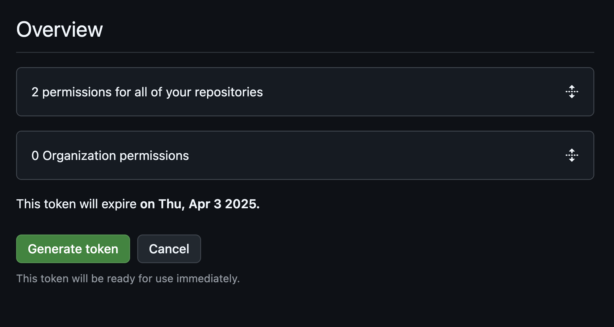

# Git-ting started with Git and GitHub
Tutorial written by ekwaly and adapted for OpenReproLab by Ruth Price

## A few concepts
Git is a code versioning and sharing tool. It is the result of 20 years of community and collaborative work by millions of developers, contributors and users. It is the perfect example of an open-source tool that has become an interoperable standard used almost universally. Your scientific work aims to do no less!

These are the standard actions you should be familiar with:
- **clone**, is the initial act of configuring and downloading a git repository and its history to your workspace
- **add**, is the act of adding a file (a notebook, for example) to the list of files to be tracked in the version history
- **commit**, is the act of saving a version of the files tracked in the history
- **push**, is the act of pushing your code version history to a remote server, in this case GitHub

There are other common or advanced concepts, but we won't go into them here.

## Time for action
Here's a step-by-step tutorial for using Git/GitHub and making your first commits/pushes.

### Step 0: create a new repo
Do you already have a GitHub repository on the OpenReproLab space? If so, go directly to step 1.

1. click on the `+` button
2. click on `New repository`

1. change the owner to `IGE-OpenReproLab2025`
2. name your repository
3. add an initial README file
4. validate

---
### Step 1: generate a new personal access token
The personal access token is our recommended way to connect your JupyterLab and GitHub. Once you've generated the token and saved it, you can use it like a password.

1. From your GitHub settings, go to `Developer settings` (right at the bottom!) > `Personal access tokens` > `Fine-grained tokens` and select `Generate new token`

2. Give the token a name (e.g. OpenReproLab)
3. Set the resource owner to `IGE-OpenReproLab2025`
4. Add an expiration date and a description

5. Select which repositories can be accessed with the token

6. Configure the permissions: under `Repository permissions`, `Contents` needs to be set to `Access: Read and write`. `Account permissions` can be left as it is.

7. Generate your token
8. Important! Copy your token so that you can use it later.

---
### Optional Step: get your GitHub anonymous email (and take care of your privacy)
If you want to be a public person and don't mind email spam, go to step 3. 

1. go to your personal account settings
2. select the `Emails` menu
3. copy your anonymous GitHub email (without the final dot)

If you don't have a anonymous GitHub email visible, you may need to strengthen your confidentiality settings first. You can do this in the same menu.

---
### Step 2: setup your git config
You now need to configure your JupyterLab space to use your GitHub identifiers.

1. open a command terminal in your JupyterLab space
2. configure your GitHub username for Git with the command `git config --global user.name` (and use your own name, not `ekwaly`!).
3. configure your GitHub email for Git with the command `git config --global user.email` (your anonymous GitHub email if you followed the previous step, not the one in the example it won't work)
4. check that the configuration is correct

---
### Step 3: clone your repository (with https://)
To be sure to use the right communication channel (HTTPS) between your JupyterLab space and your GitHub.

1. go to the work repository
2. check that you are on the `code` tab
3. click on the `<> code` button
4. check that you are on the `HTTPS` tab
5. copy the address

Now you need to clone your reprository, i.e. download it and configure it in your JupyterLab space.

1. open a command terminal in your JupyterLab space
2. clone the repository using the `git clone` command + the previously copied address
3. enter the created folder (named after your repository) with `cd`
4. check that all has been downloaded correctly

Don't forget to work WITHIN your repository root folder. Only what's in there can be versioned and saved via git.

---
### Step 4: commit your work
Commit allows you to add a version to your work history. This is a local operation, so it has nothing to do with GitHub (the remote server), but it is essential if you then want to back up there (with push).

To commit, you first need to `add` the files you want to track in the history. Often you `add`/track all the files in the cloned repository, for simplicity's sake, and then exclude some of them (search .gitignore on internet if you need to).

1. create an empty file, for the example
2. if necessary, check the status of the repository to list untracked files
3. add all the untracked files in the next commit with `git add -A` (`-A` means all)
4. if necessary, check the files that are going to be committed

Everything is ready to commit the tracked files and add the current version of these files to the history.

1. run the command `git commit -m "message"` and add a clear comment about what the commit contains
2. view the changes applied between the previous version and the new one

You should be aware that there are various best practices for making a good commit message, as well as for when and at what stage to commit. This is not the subject of this tutorial but you can find some good resources everywhere.

A set of very simple rules that you can apply:
- make a commit at least 1 time a day (it helps with motivation!)
- commit at every stable state of your work, whatever stable means to you
- 1 idea = 1 commit, don't mix things up, it'll make life easier
- keep your commit short, if your idea is complex, or involves big changes, split it!
- don't try to modify a previous commit, git is designed to work forwards: to rollback you make a new commit with a previous version of your work
- do not try to keep a clean history, it's hard, restrictive and not very useful, but later on you'll naturally learn to keep it nice without too much effort

---
### Step 5: push you work
It's now time to push! Dead simple, if possible: push your work after each commit. Push is the action of sending your history to GitHub (or another remote server). When you're working alone, you can push as often as you like. When you work collaboratively on a repository, you'll see that there's a little organization to be defined between the contributors. But let's save that for another time.

1. push your history with `git push`
2. see the GitHub repository on which it lands

