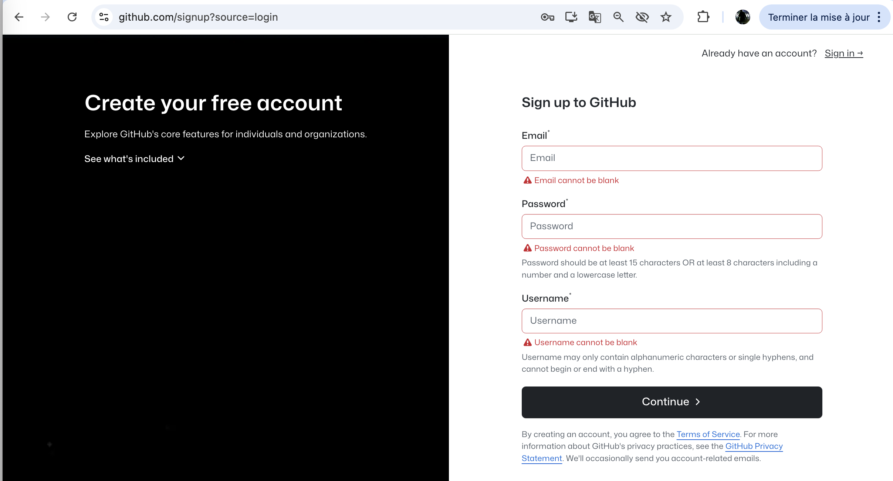
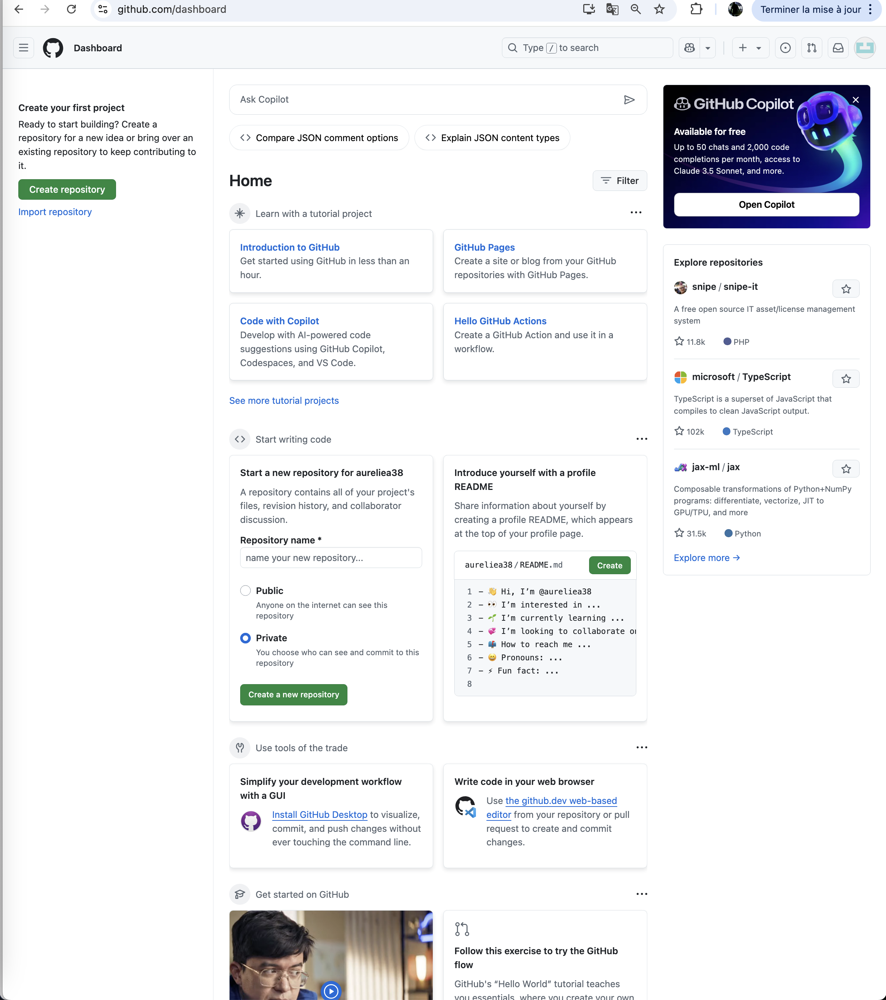
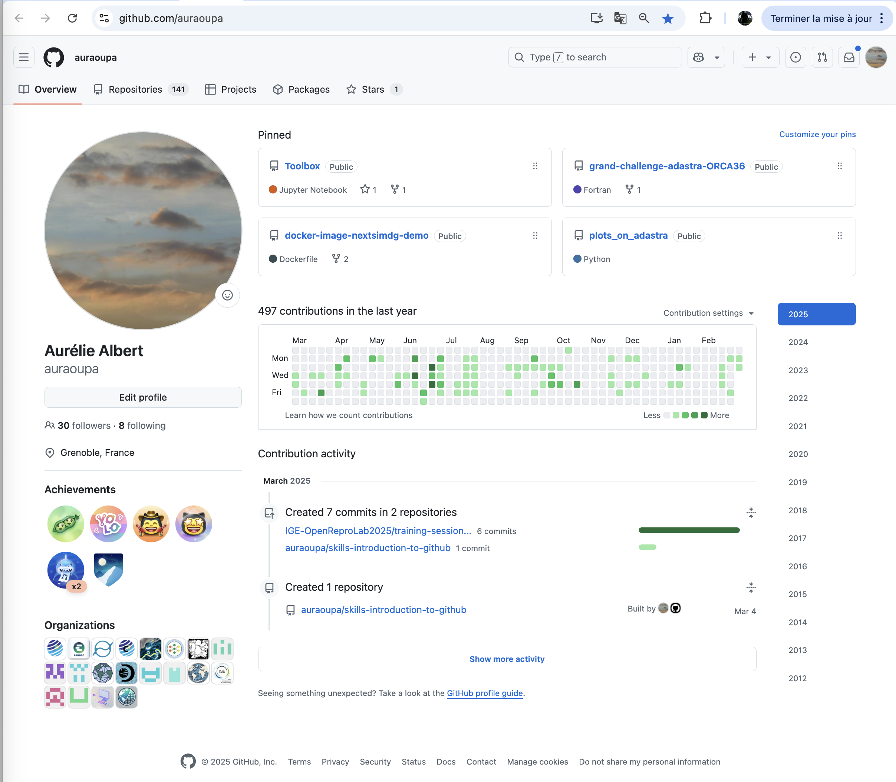
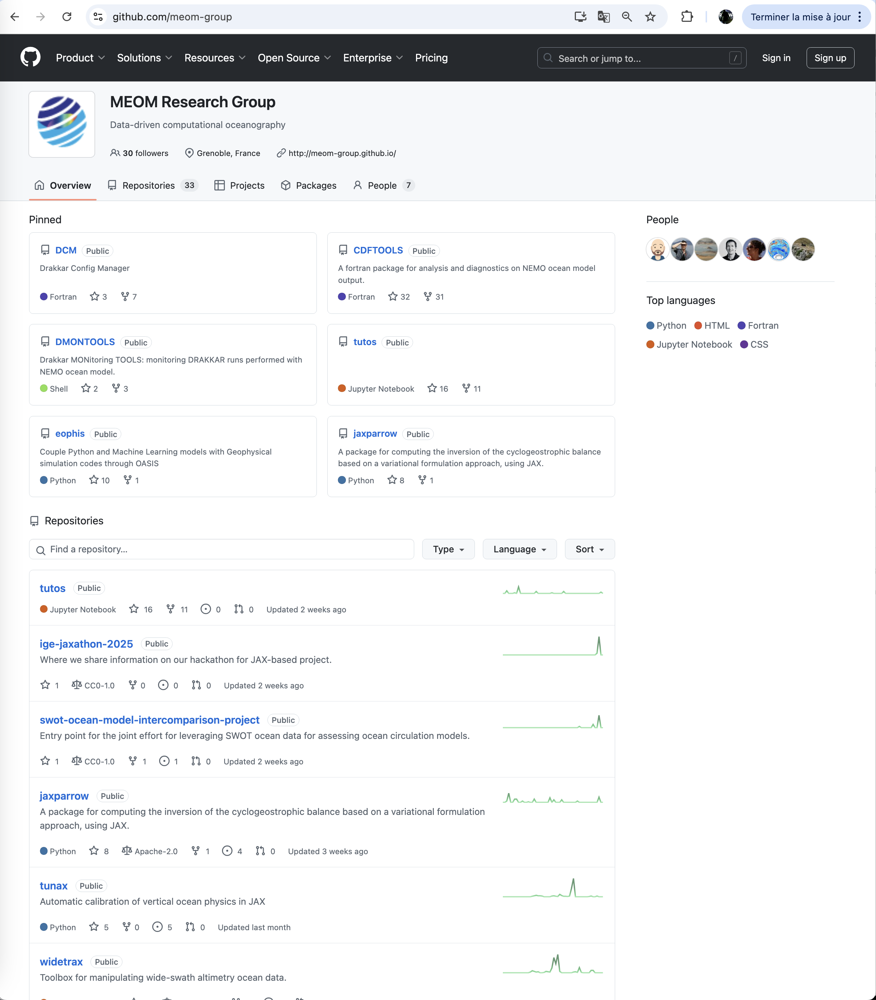
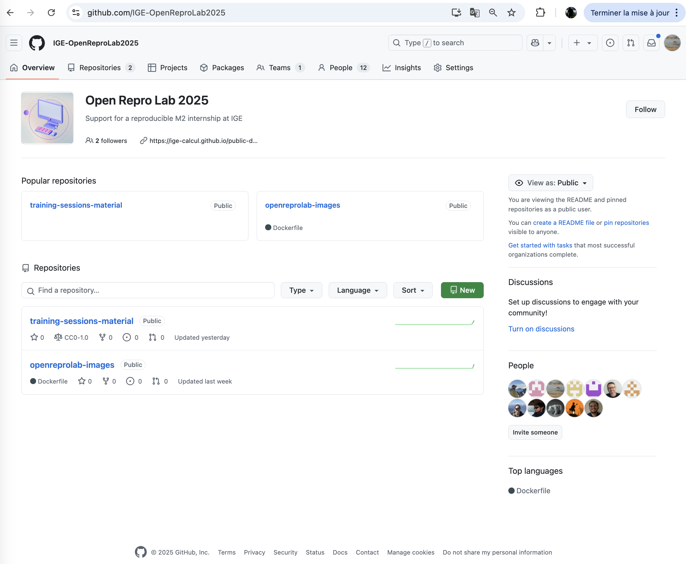
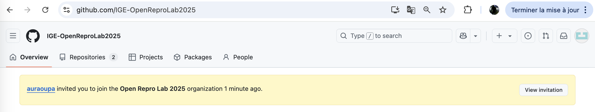

# GITHUB BASICS

## WHAT IS GITHUB

GitHub is a web-based platform that allows users to store and share code, collaborate with others, and manage version control. 
With some of its options, it is also possible to automate tests, discuss with users or collaborators and manage an entire project.
It can also host static websites directly from a repository.

## WHY USE GITHUB

- store the code and its history of developments online (back-up)
- download/upload it to/from any machine (distribute)
- share code easily with others (notebooks are rendered on github)
- community of users : you can interact, follow other people's work
- easy to work together on the same project

## CREATE AN ACCOUNT ON GITHUB

Go to [github.com](github.com) and sign up for an account

We recommend that you use your personnal email as it will be a personnal github account that will follow you along your career

You can personnalize your profile as you wish and learn some of github functionnalities from the dashboard

Over time your personnal dashboard will be filled with repositories, a tracker of your activity, some notifications, a list of organizations you have joined

## JOIN AN EXISTING ORGANIZATION

A github organization is a github account for an entity like a team, a lab, a model or anything, you can create it from your personnal account and add members to it that can also become owners

So now that you have your own personnal account, you have to send your login id to the owners (Aurélie, Mykael, Mondher or Julien) and we will invite you to join the IGE-OpenReproLab2025 organization 

Then an invitation will be sent to your personnal mail

or you can just visit [github.com/IGE-OpenReproLab2025](github.com/IGE-OpenReproLab2025) and a banner will be waiting for you

