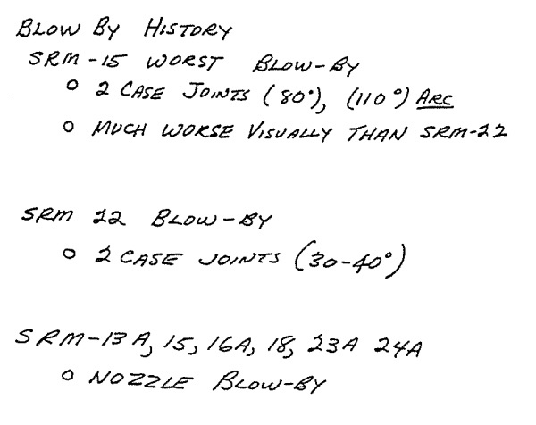
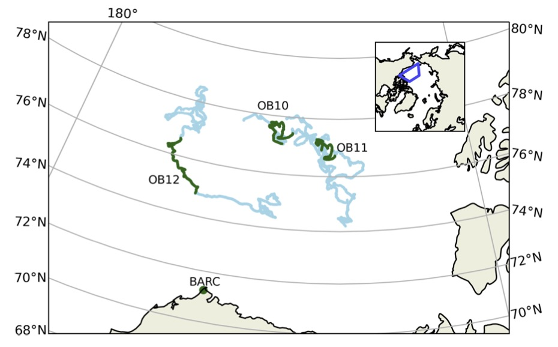

Why make a (good) plot?
-----------------------

* To communicate information
* "A picture is worth a thousand words"

### An example

This example is taken from Edward Tufte's book [Visual Explanations: Images and Quantities, Evidence and Narrative](https://www.edwardtufte.com/book/visual-explanations-images-and-quantities-evidence-and-narrative/).

On January 28, 1986 the space shuttle Challenger, manned by seven astronauts including a civilian schoolteacher, exploded shortly after launch. Subsequent investigation blamed a faulty O-ring that stiffend in the below-freezing weather and failed to seal.

| | |
|-|-|
|  |  |

The previous day, the contractor that built the rocket had requested a launch delay based on their engineers' concern that the forecast low temperatures could present a risk of O-ring failure. NASA responded that the evidence the engineers presented did not conclusively link O-ring problems to low temperature, and ultimately the contractor agreed that the launch should go ahead.

Here are two of the slides from the presentation arguing for a launch delay. These slides were shown separately, accompanied by an oral presentation. The first lists test launches that experienced O-ring damage and the second lists environmental conditions for some of the test launches. The row "SRM-25" shows the forecast temperatures for the actual launch (from Tufte's *Visual Explanations*):

Do you see a link between ambient temperature and O-ring damage?

The presentation also included a plot showing temperature and O-ring damage in all previous test launches. The legend for this slide was shown on a previous slide; vertical hash marks indicate different types of O-ring damage (from Tufte's *Visual Explanations*):

Would you delay the launch based on these slides?

Tufte argued that the engineers might have been more convincing if they had shown a plot like this (from Tufte's *Visual Explanations*):

What do you think?

What makes a good plot?
-----------------------

### Dos and Don'ts

**Do**:

* Make the story clear
  * Good plot type
  * Good colors & map projections
  * Good axis/colorbar ranges
* Avoid distractions
  * Avoid clutter
  * Use appropriate fonts
* Make it easy to understand
  * Units, axis labels, key/legend
  * Title (sometimes optional)
  * Figure caption (write it!)

**Don't**:

* Confuse or mislead
  * Inappropriate plot type
  * Inappropriate colors/projections
  * Poor axis/colorbar scale/range
* Distract
  * Show too much information
  * Inappropriate fonts
* Make it hard to understand
  * Text/plot elements too small
  * No units, axis labels, key/legend
  * Confusing or ambiguous caption

### Examples

Here are some examples of plots from Jennie's papers. What do you think they do well? What could be improved?

#### Example 1

Source: https://doi.org/10.5194/acp-22-14467-2022

**Figure 2.** Locations of MAX-DOAS BrO observations used in this work. Blue lines show the drift tracks of O-Buoys, with green showing the locations with valid BrO measurements in spring 2015. Location of Barrow Arctic Research Center (BARC) in Utqiaġvik indicated by green dots. True color MODIS imagery on 1 April 2015 shows typical sea ice coverage (NASA, 2015). The inset map shows the location of the map grid within the Northern Hemisphere.

#### Example 2

Source: https://doi.org/10.1186/s43591-022-00048-w

**Fig. 3** Plastics dispersal through Earth surface reservoirs from 1950 to the year 3000, following a halt on production and discard in 2025. This unrealistic model scenario illustrates over what timescales discarded microplastic (P, > 5 mm), large microplastic (LMP) and small microplastic (SMP, < 0.3 mm) potentially disperse via rivers and air into oceans, remote terrestrial surfaces, beach and marine sediments. A P and LMP disappear in all transitory reservoirs within 100 and 200 years due to fragmentation at an annual rate of 3%. The prolonged dispersal of SMP in all reservoirs is driven by cyclical marine emissions to air, deposition to terrestrial surfaces, runoff to surface oceans, and re-emission to air. Only a small fraction of SMP sinks to shelf sediments and to the deep ocean, followed by slow sedimentation to deep ocean sediments. SMP mass, and concentrations, in the surface ocean and atmosphere, where human SMP exposure is relevant, only return to 2025 levels towards the year 5000 (Fig. 4)

#### Example 3

Source: https://doi.org/10.1029/2022JD038235

**Figure 1.** Arctic and Antarctic measurement stations providing sea salt surface mass concentration data. Blue colormaps indicate areas with a sea ice concentration above 50%. The lighter blue is for February in the Arctic, and August in the Antarctic. The darker blue is the opposite. The sea ice data are from ERA5. The black dashed line shows the 60° limit considered for regional aggregated analyses. Abbreviations in the maps are the first two letters of the corresponding station name.

#### Example 4

Source: https://doi.org/10.1029/2022JD038235

**Figure 8.** Annual cycle of sodium aerosol surface mass concentrations at nine stations in the Arctic (top and middle) and five stations in the Antarctic (bottom). Observations are in black (caps show one standard deviation of monthly means), individual CMIP6 models (1951–2014) are in light blue, CMIP6 ensemble mean (solid thick line) is in blue. CMIP6 values are bias corrected by applying a factor <OBS> / <MODEL>. Boxes indicate the Pearson correlation coefficient between the annual cycle in CMIP6 ensemble mean and observations, with the 95% confidence interval between brackets.

#### Example 5

Source: https://doi.org/10.1525/elementa.2022.00129

#### Example 6

Source: https://doi.org/10.1525/elementa.2022.00129

**Simulated mean surface ozone concentration.** Surface ozone concentration is averaged for the full simulation period (March 14 to April 14, 2020). Observational averages for the same period are shown by markers with the same colour scale.

#### Example 7

Source: https://doi.org/10.1525/elementa.2022.00129

**Model comparison of surface ozone concentrations with observations from Arctic stations.** Hourly average of surface O3 observations (black) and simulated O3 by WRF-Chem (red) at (a) Villum, Greenland; (b) Alert, Canada; (c) Zeppelin, Svalbard; (d) Utqia͘gvik, Alaska; (e) Summit, Greenland; and (f) Eureka, Canada. Grey dashed lines represent the value of O3 depletion events (<10 ppb). Red-shaded areas represent the minimum and maximum values simulated by WRF-Chem around the station grid cell in a 3×3 and 5×5 grid.

Color
-----

Color is a key element for creating clear, informationally dense, and aesthetically pleasing plots. Yet it is also one of the most frequently misused plotting elements. Note how the perceptually non-uniform "jet" colormap (**b**), highlights specific areas of the image, making it harder to recognize than the more perceptually uniform colors of **a** and **c**.

### Tips for using color in plots:

* Use colors that shows your results clearly and honestly
* Consider colorblind readers
* Consider recommendations on best use of color (not always agreed on!) e.g. [Nature Reviews' guide to designing figures](https://www.nature.com/documents/natrev-artworkguide_PS.pdf)
* When in doubt, a perceptually uniform colormap is a usually good choice for continuous data

### Resources for choosing colormaps:

* [Colorbrewer](https://colorbrewer2.org/): sequential, diverging, and qualitative colormaps
* [i want hue](https://medialab.github.io/iwanthue/): qualitative colormaps
* [Scientific Color Maps](https://www.fabiocrameri.ch/colourmaps/): perceptually uniform colormaps. See also the accompanying paper [Crameri et al. (2020) The misuse of color in scientific communication](https://doi.org/10.1038/s41467-020-19160-7). Fig. 6 is a decision tree for choosing an appropriate colormap based on your data.
* Matplotlib's [choosing colormaps page](https://matplotlib.org/stable/users/explain/colors/colormaps.html): lists the built-in colormaps and offers some guidance on their use.
* [NASA earth observations datasets](https://neo.gsfc.nasa.gov/): each dataset has a downloadable colormap (ACT format).
* [cmweather](https://cmweather.readthedocs.io/en/latest/api.html): colormaps for weather and climate data
* [cmocean](https://matplotlib.org/cmocean/): colormaps for common oceanographic variables.
* [NASA blog series on color](https://earthobservatory.nasa.gov/blogs/elegantfigures/2013/08/05/subtleties-of-color-part-1-of-6/): good overview of basic color theory, how and why to use color

Guidance and inspiration
------------------------

[Data-to-viz](https://www.data-to-viz.com/): decision trees that guide you to an appropriate plot type (scatterplot, histogram, line plot, ...) based on what kind of data you have (numeric, categorical, ...). It briefly explains what the visualization is good for, lists some common mistakes, and links to example plots with code in Python, R, D3.js, and React.

[Python Graph Gallery](https://python-graph-gallery.com/): a large collection of plots. You choose a plot type and then browse examples, each accompanied by the plot code, which usually uses [seaborn](https://seaborn.pydata.org/) or [matplotlib](https://matplotlib.org/).

[R Graph Gallery](https://r-graph-gallery.com/): like the Python Graph Gallery, but for R. While you won't find python code here, you may find some inspiring plots that aren't listed in the Python Graph Gallery. Most plots are made with [ggplot2]() and so should be straightforward to recreate with [plotnine](https://plotnine.org/).

[Nature Reviews's guide to designing figures](https://www.nature.com/documents/natrev-artworkguide_PS.pdf) provides recommendations and guiding principles for designing plots and conceptual figures.

Journal articles:

* [Rougier et al. (2014) Ten simple rules for better figures](https://doi.org/10.1371/journal.pcbi.1003833)
* [Kelleher & Wagener (2011) Ten guidelines for effective data visualization in scientific publications](https://doi.org/10.1016/j.envsoft.2010.12.006)
* [Gelman et al. (2002) Let's practice what we preach: turning tables into graphs](https://doi.org/10.1198/000313002317572790)

Python plotting libraries
-------------------------

[Matplotlib](https://matplotlib.org/) is by far the most widely-used python plotting library. It allows full customization of static, animated, and interactive visualizations. Data objects from [xarray](https://docs.xarray.dev/en/stable/) and [pandas](https://pandas.pydata.org/) have built-in methods for plotting with matplotlib. Because it is so popular, there are many tutorials and stack overflow questions to turn to if you need help. Large language models also tend to respond fairly well to matplotlib-related prompts. Matplotlib plotting code can be fairly verbose as complex plots often require explicit data preprocessing and mapping to plot elements.

[Cartopy](https://scitools.org.uk/cartopy/docs/latest/) extends matplotlib with methods for plotting geographic data. It implements several coordinate reference systems and provides methods for adding "features" (points, lines, polygons) to a plot, including global [Natural Earth](http://www.naturalearthdata.com/) vector data such as coastlines, lakes, rivers and country borders.

[Seaborn](https://seaborn.pydata.org/) is a wrapper for matplotlib focused on statistical visualization of data in [pandas](https://pandas.pydata.org/) data structures. It's goal is to automate many of the mechanics of drawing the plot, allowing you to focus more on what you want to show.

[Plotnine](https://plotnine.org/) is an implementation of [The Grammar of Graphics](https://link.springer.com/book/10.1007/0-387-28695-0) based on the [ggplot2](https://ggplot2.tidyverse.org/) R package. Like seaborn, plotnine provides many higher-level methods that let you concisely describe what you want to show without needing to specify every semantic mapping or implement every statistical aggregation. It may be of interest to people who are already familiar with ggplot2.

[Plotly](https://plotly.com/python/) is a multi-language graphing library (Python, R, Julia, Javascipt, MATLAB) focused on interactive graphics. Its main advantages are that figures are interactive by default (zoom, pan, hover for more information, filter data) and it lets you make plots in multiple programming languages with a consistent API rather than needing to learn a new library for each language.

[Bokeh](https://bokeh.org/) is another library focusing on interactive graphics.

Examples
--------

See [improving-plots.ipynb](improving-plots.ipynb)
