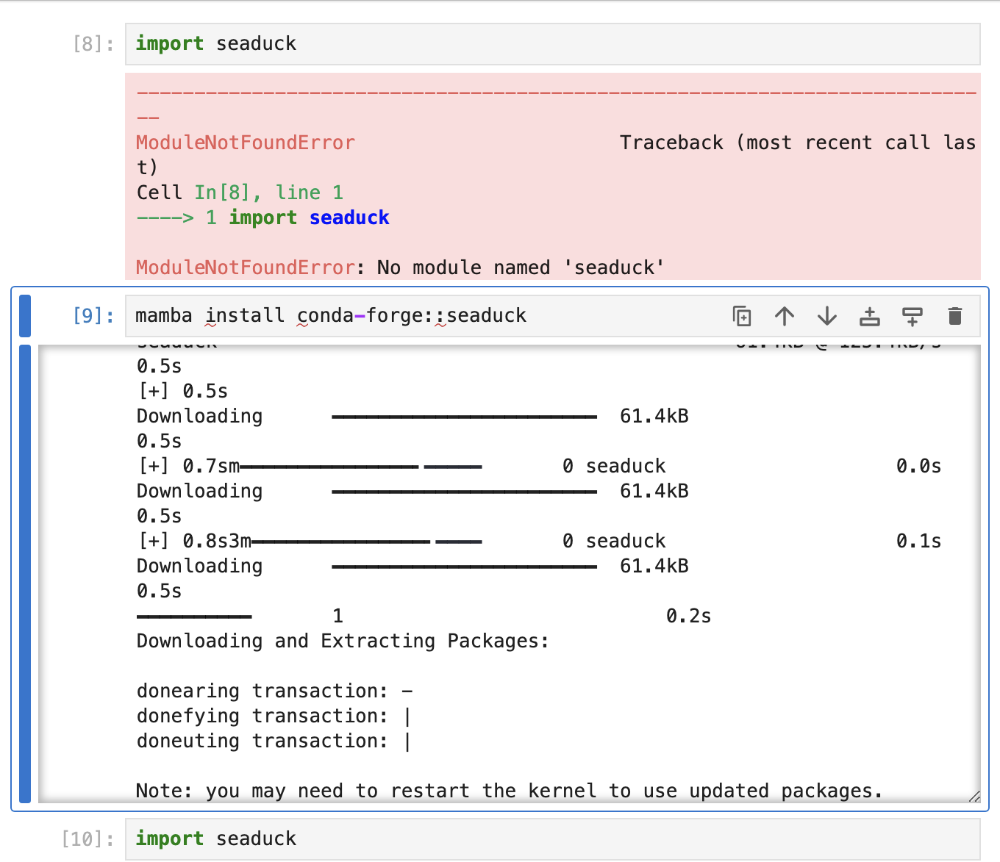
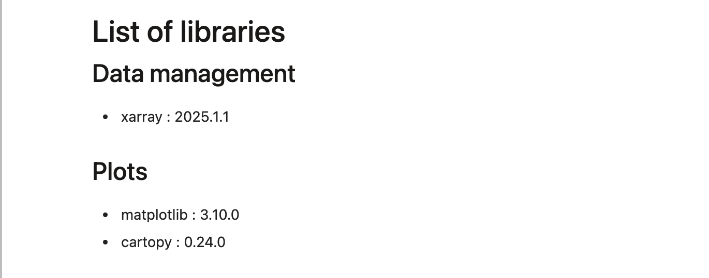
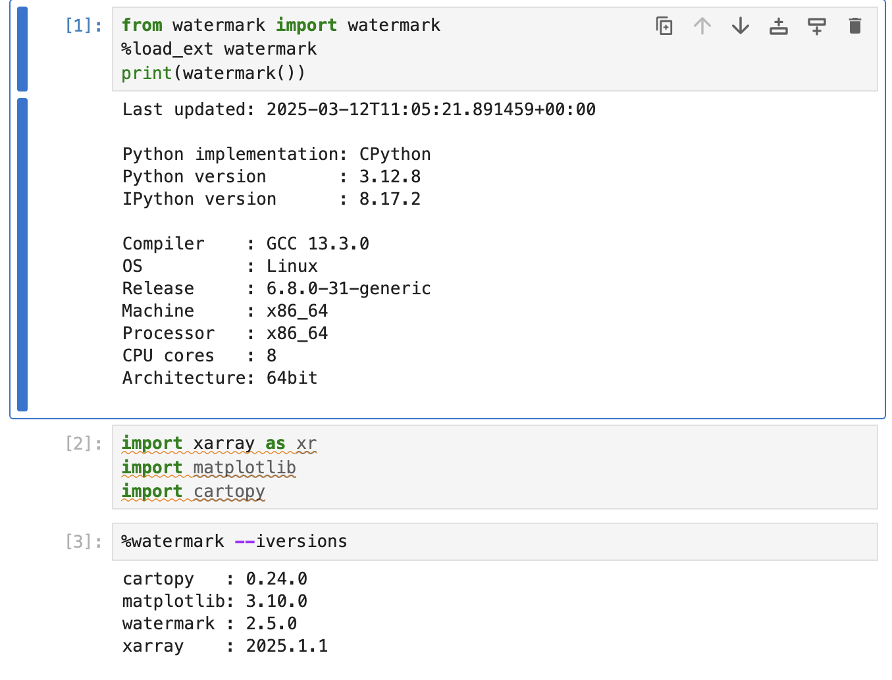

# Python environmnents 

## What we will cover 
 - how to install new packages 
 - what are environments and why we need them
 - the environment available on our Jupyterhub
 - how to customize your environment
 - documenting you environment in Jupyter notebook

## How to install new packages 

Common tools used for Python package installation :

  - [pip](https://pip.pypa.io/en/stable/user_guide/)
  - [venv](https://docs.python.org/3/tutorial/venv.html)
  - [virtualenv](https://virtualenv.pypa.io/en/latest/)
  - [conda](https://docs.conda.io/projects/conda/en/latest/user-guide/index.html)
  - [mamba](https://mamba.readthedocs.io/en/latest/index.html)

We recommend you stick with one package manager to avoid [conflicts](https://xkcd.com/1987/)

As mamba is already installed on the jupyterhub it is the obvious choice for OpenReproLab

An example :

<p align=center></p>


## What are environments and why we need them

Sometimes one application needs a particular version of a package but a different application needs another version. Since the requirements conflict, installing either version will leave one application unable to run. This situation can be resolved by using virtual environments. A virtual environment is a semi-isolated Python environment that allows packages to be installed for use by a particular application or for a particular project.


 - fresh environment creation : ```mamba create -n nameofmyenv <list of packages>```
 - cloning an existing environment : ```conda create --name myclone --clone myenv``` (example base environment on the jupyterhub)
 - creation from a requirement file : ```conda env create -f environment.yml```

with environment.yml :

```bash
name: atlaslice
channels:
  - conda-forge
  - pypi
  - defaults

dependencies:
  - python=3.11
  - xarray=2023.6.0
  - numpy=1.25.0
  - scipy=1.13.0
  - numba
  - pandas=1.5.3
  - matplotlib=3.7.1
  - netcdf4=1.6.2
  - jupyter=1.0.0
  - ipython=8.12.0
  - ipykernel=6.19.2
  - ffmpeg=4.2.2
  - dask=2023.6.0
  - cmocean=3.0.3
  - cartopy=0.21.1
```

## The environment available on our Jupyterhub
Managing software environments can sometimes become complex and confusing. To avoid recurring problems, use a single dependency manager. This applies to all languages!

So don't mix `pip` commands with `conda` or `pipx` commands. The only exception are `conda` and `mamba` commands which are interchangeable. Think of them as a single command, `mamba` is simply faster.

> [!IMPORTANT]
> Here we'll use [**Mamba**](https://mamba.readthedocs.io) with the `mamba`command. 

**Mamba** (or similarly **Conda**) is a very complete package manager, allowing you to install not only **Python** packages, but also system packages and other languages such as **R**. That's why, in practice, **Mamba** is enough to handle any situation you may encounter.

By default, a **Mamba** environment is installed in your online **JupyterLab**. This is a **Pangeo** environment known simply as "_notebook_". **Pangeo** is a community of geoscientists who have listed the most commonly used packages in **Python**.

```bash
mamba list # To obtain a list of the packages in the environment you're using
```

Every terminal you open in **JupyterLab** automatically loads this "_notebook_" environment by default (this behavior may change if you tinker). So if you're lost, just relaunch your terminal.

```bash
mamba info # To learn more about your currently loaded environment
```

When you open a notebook via the **JupyterLab** launcher, there is a choice available: "_Python 3 (ipykernel)_" kernel (see below).

<p align=center></p>

A "_kernel_" is a **Mamba** environment ready to be used in a notebook. Here, the _"Python 3 (ipykernel)"_ kernel corresponds to the **Pangeo** "_notebook_" environment.

> [!WARNING]
> Each terminal can load a different **Mamba** environment and a notebook kernel is not linked to any terminal environment. These are different contexts which must be configured separately.

## How to customize your environment

This default environment may become insufficient. You may need a specific **Python** library to manipulate your data, or a system package to complement your **Bash** script.

In your **JupyterLab** online, the default **Pangeo** "_notebook_" environment cannot be persistently modified. This means that if you install a package, it will disappear the next time you reboot. So you need a new **Mamba** environment.

```bash
mamba create -n my-env-name # To create a new environment that will exist throughout your next sessions
```

You then need to "_activate_" this new **Mamba** environment to be able to use its packages. Activation is not automatic when a new terminal is opened, so you may need to activate it if necessary.

```bash
conda activate my-env-name # To activate another environment
```

> [!WARNING]
> Note that the command `conda activate ...` is used instead of `mamba activate ...` here, on purpose. If you run `mamba activate ...`, the terminal will first ask you to run `mamba init`. However, `mamba init` permanently alters the behavior of **JupyterLab**, so I don't recommend it. This is the only exception to the use of `mamba` and is specific to **OpenReproLab**.

This "_my-env-name_" environment is personal and contains almost no packages. It cannot become a notebook kernel because it lacks the essential "_ipykernel_" package.

```bash
mamba install ipykernel # To install the package in the currently activated environment
```

After a few minutes at most, you should be able to use this environment as a kernel to run your notebooks.

<images>

Don't forget that this environment is almost empty. You'll need to install all the libraries you need, such as "_xarray_" or "_cartopy_".

Once again, don't mix `python -m`, `pip`, `pipx` commands with `mamba` or `conda` commands. There's a very good chance that what you're looking to install exists in the **Conda** "_forge_", i.e. the **Conda**/**Mamba** package list.

> [!NOTE]
> Example 1: you need a Python library whose documentation recommends using `pip install lib-1`? There's a very good chance that `mamba install lib-1` will install the same package, or perhaps `mamba install lib_1` - check it out on the Web!

> [!NOTE]
> Example 2: You need the `curl` system command? Then `mamba install curl` will let you use it in a terminal! No need to run `apt install curl`.

## Documenting your environment in jupyter notebook

You can do it by hand with markdown syntax in a cell :

<p align=center></p>


The library watermak allows you to do it automatically :

<p align=center></p>


