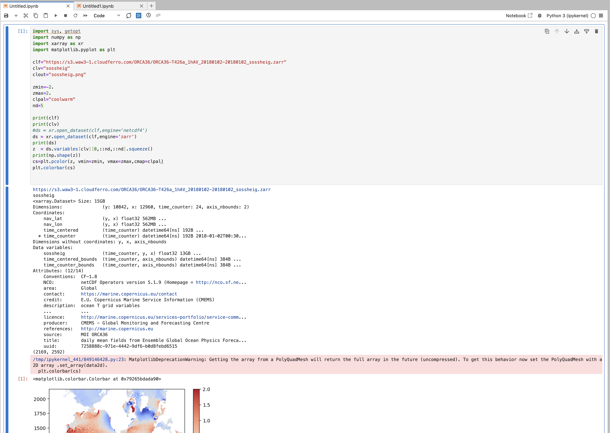
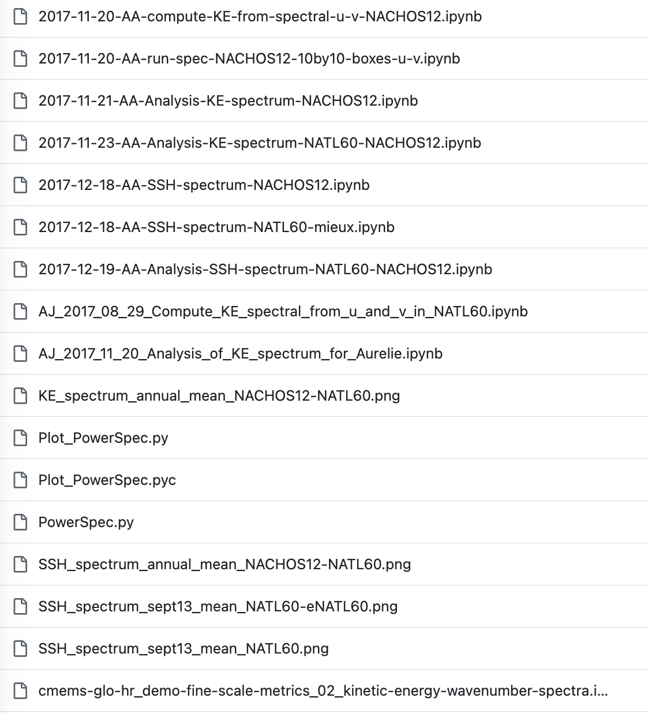
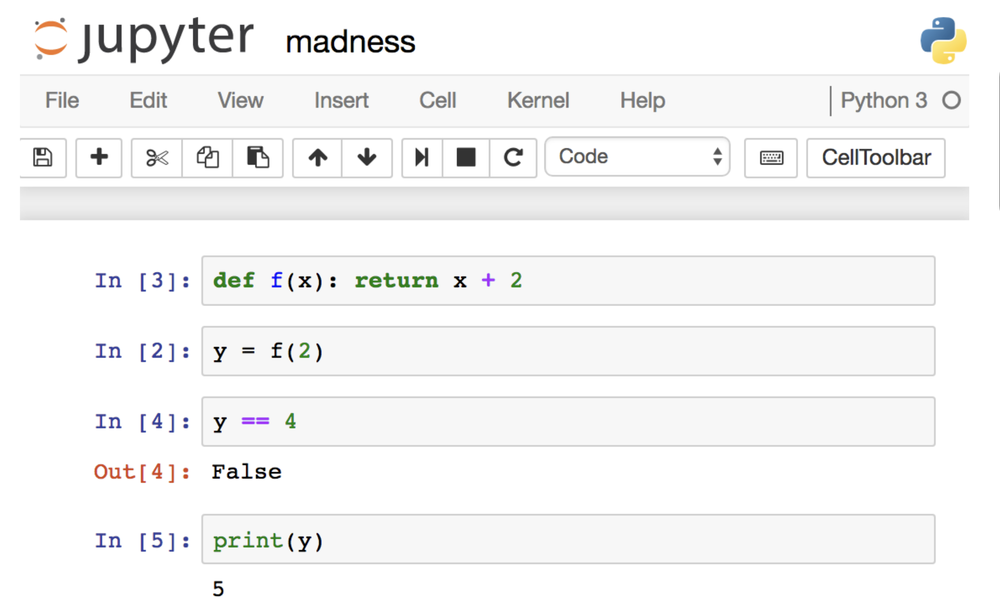
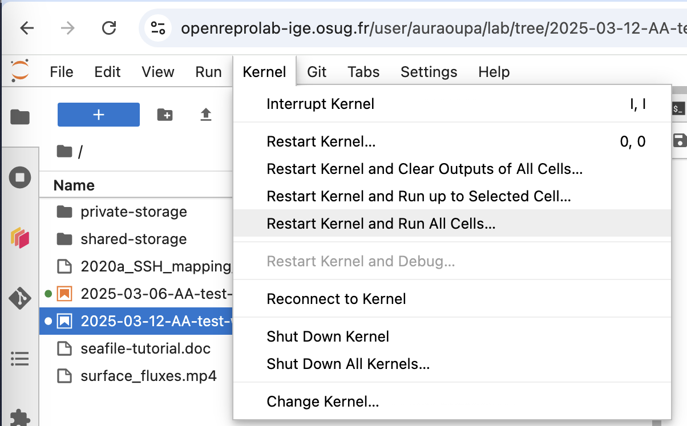
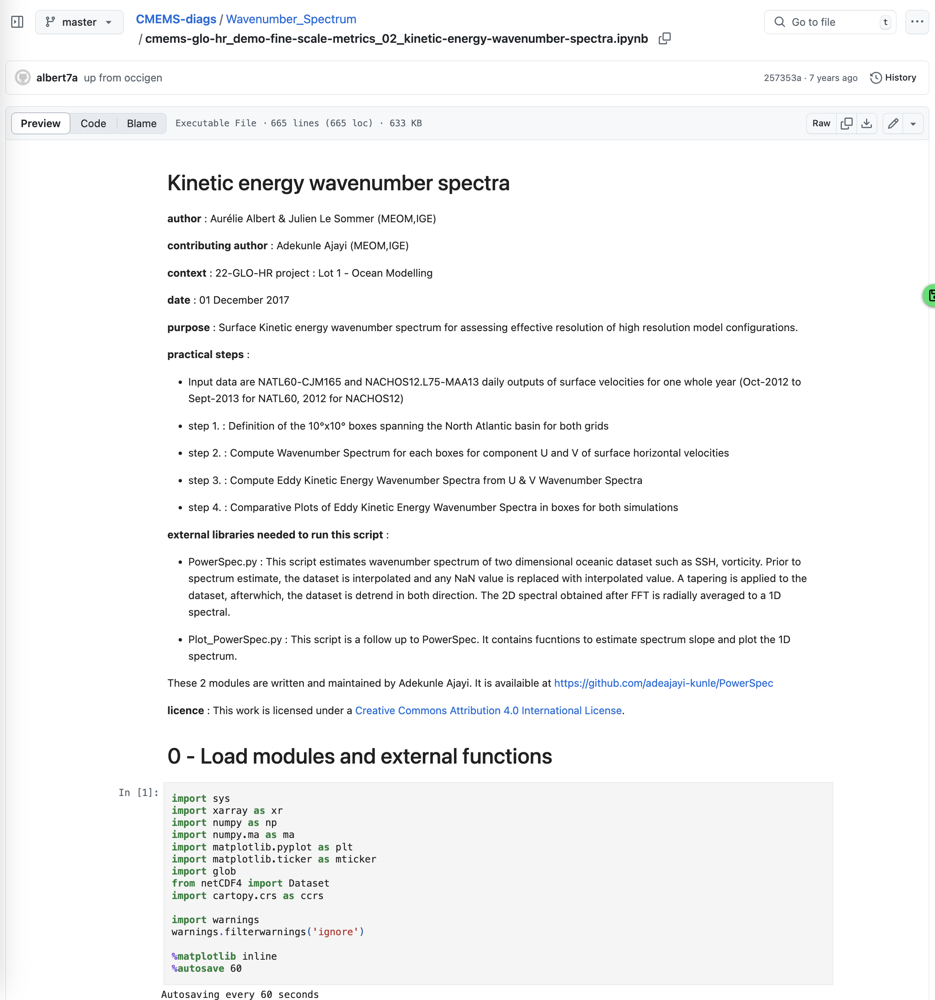
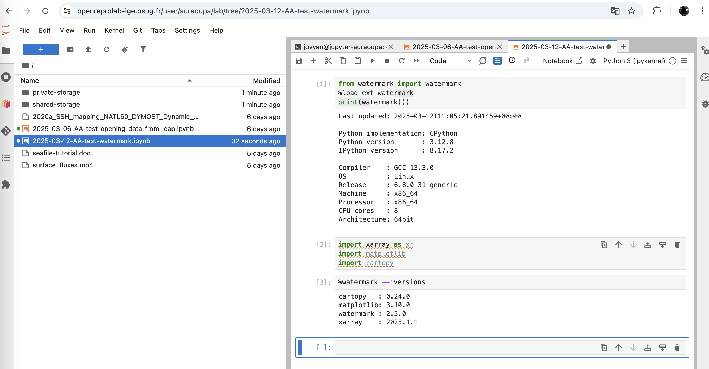

# Reproducible notebook

## POP QUIZZ

### Notebook 1

What is wrong with this notebook ?

How to fix it :

What is wrong with this notebook ?

How to fix it :

What is wrong with this notebook ?

How to fix it :

## 10 rules for a reproducible notebook

Source : [a paper by Adam Rule et al.](https://journals.plos.org/ploscompbiol/article?id=10.1371/journal.pcbi.1007007#pcbi.1007007.ref015)

### TELL A STORY FOR AN AUDIENCE

title

markdown

### DOCUMENT THE PROCESS, NOT JUST THE RESULTS

comments

### USE CELL DIVISIONS TO MAKE STEPS CLEAR

### MODULARIZE CODE

functions, papermill

### RECORD DEPENDENCIES

watermark

### USE VERSION CONTROL

### BUILD A PIPELINE

### SHARE AND EXPLAIN YOUR DATA

### DESIGN YOUR NOTEBOOKS TO BE READ, RUN AND EXPLORED

