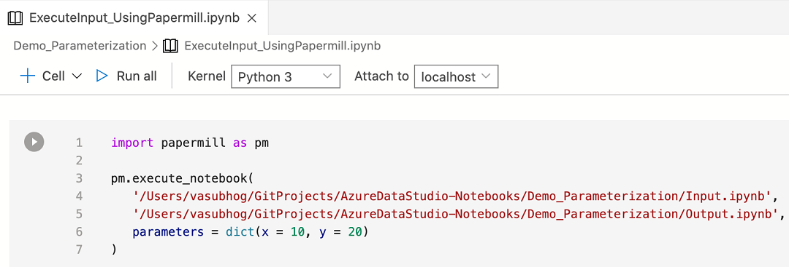

# Reproducible notebook

## POP QUIZZ

### Notebook 1

What is wrong with this notebook ?

How to fix it :

What is wrong with this notebook ?

How to fix it :

What is wrong with this notebook ?

How to fix it :

## 10 rules for a reproducible notebook

Source : [a paper by Adam Rule et al.](https://journals.plos.org/ploscompbiol/article?id=10.1371/journal.pcbi.1007007#pcbi.1007007.ref015)

### TELL A STORY FOR AN AUDIENCE

Use meaningful title and markdown syntax in order to be as clear as possible for future readers (the reader can be you !)

### DOCUMENT THE PROCESS, NOT JUST THE RESULTS

Explain the intermediate steps and even the failed attemps not to reproduce them again

### USE CELL DIVISIONS TO MAKE STEPS CLEAR

A compromise between a line of code by cell and all the code in one cell, separate code by steps : all the imports, data ingestion, one function per cell, executing in one cell ...

### MODULARIZE CODE

Instead of duplicating cell to repeat an operation that more than 5 lines long, create a function with arguments that does the same

If you are tempted to duplicate an entire notebook to change one or a few parameters, use papermill instead

### RECORD DEPENDENCIES

Use watermark inside the notebook to fix the versions used in it

### USE VERSION CONTROL

### BUILD A PIPELINE

### SHARE AND EXPLAIN YOUR DATA

### DESIGN YOUR NOTEBOOKS TO BE READ, RUN AND EXPLORED

